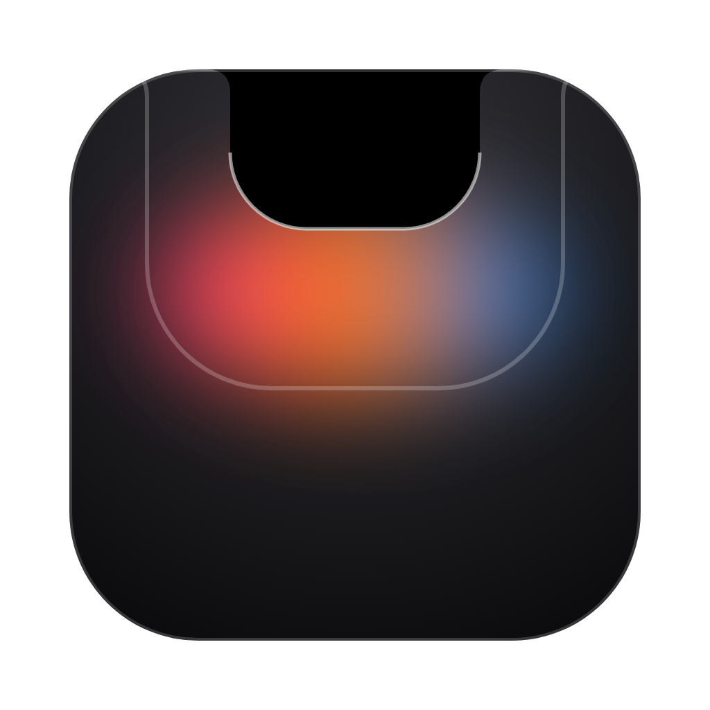
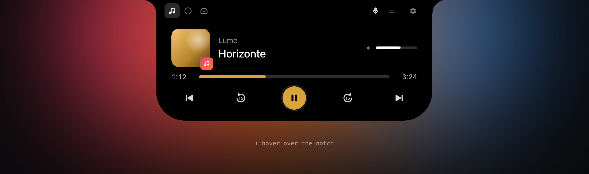
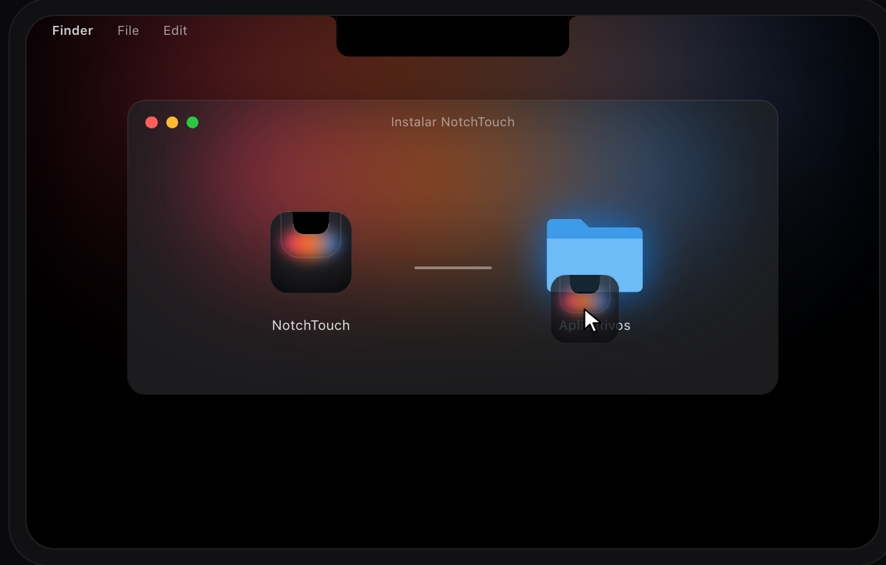
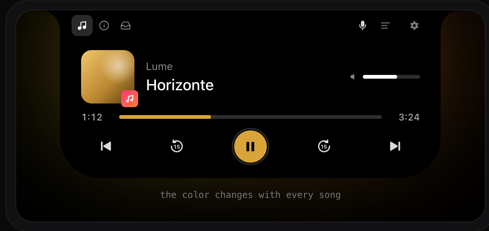
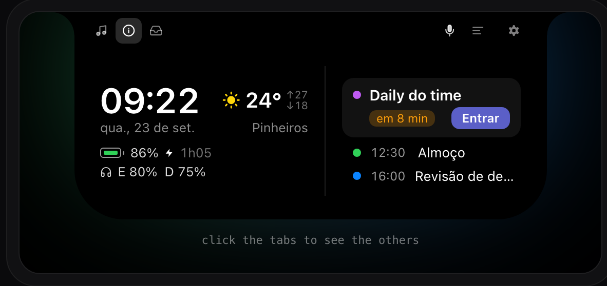
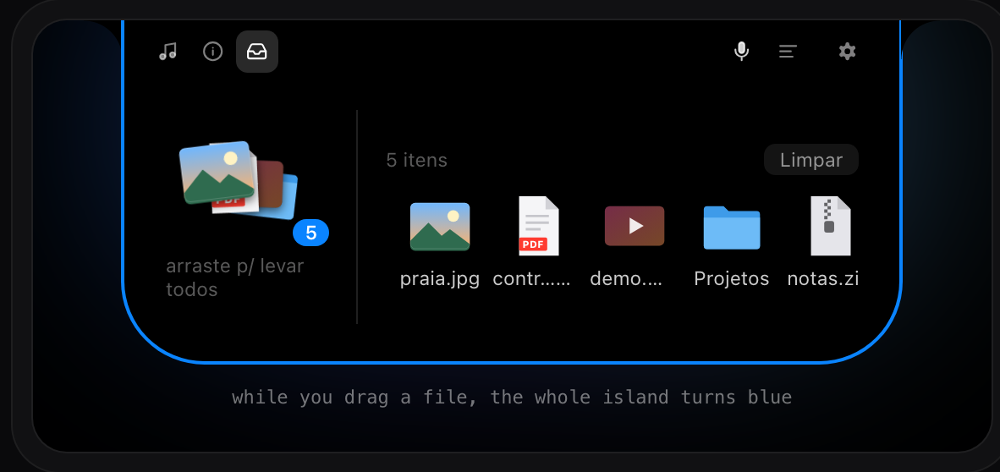
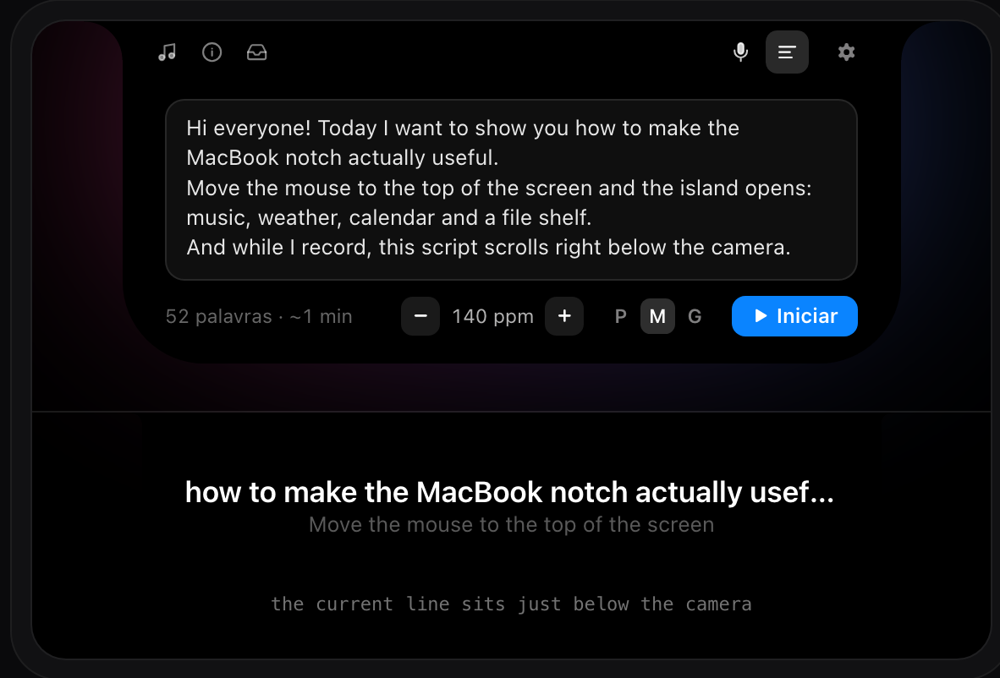
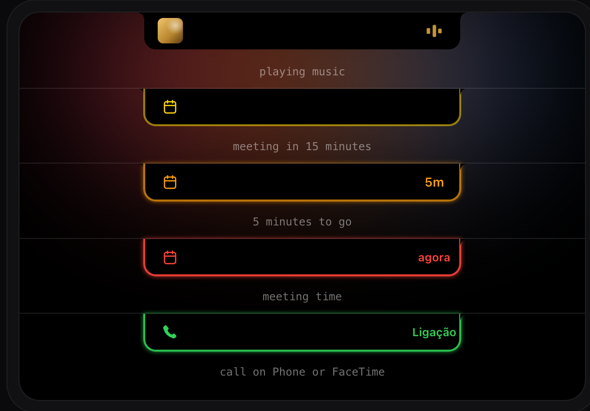
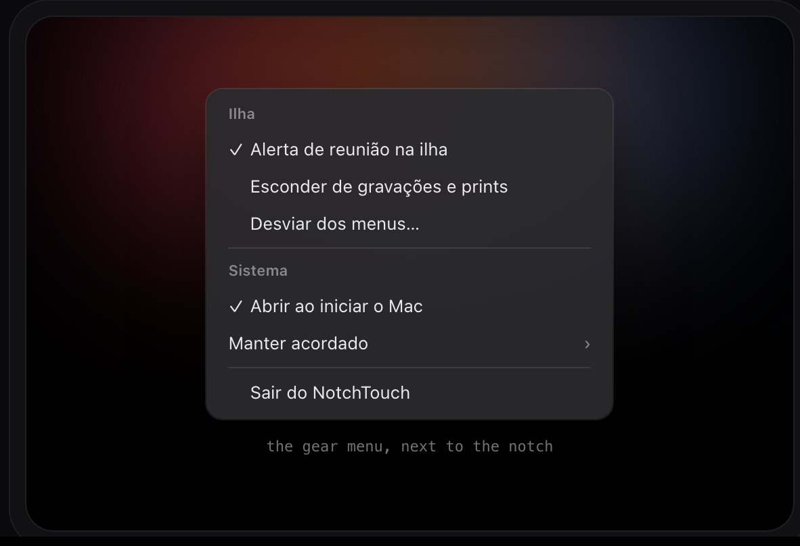

<p align="center">
  
</p>

<h1 align="center">NotchTouch</h1>

<p align="center">
  A free Mac app that turns the MacBook notch into a small, useful island:<br>
  music, weather, calendar, a file shelf and a teleprompter, right below your camera.
</p>

<p align="center">
  <a href="https://github.com/notchtouch/notchtouch/releases/latest/download/NotchTouch.dmg"><b>Download the latest version (.dmg)</b></a>
  ·
  <a href="https://github.com/notchtouch/notchtouch/issues/new/choose">Report a bug</a>
  ·
  <a href="https://github.com/notchtouch/notchtouch/releases">All releases</a>
</p>

<p align="center">
  
</p>

This repository holds the documentation, the downloads and the issue tracker for NotchTouch. The source code is private.

## Contents

- [Requirements](#requirements)
- [Install](#install)
- [Getting started](#getting-started)
- [Features](#features)
  - [Music](#music)
  - [Info](#info)
  - [Shelf](#shelf)
  - [Script (teleprompter)](#script-teleprompter)
  - [Live island and alerts](#live-island-and-alerts)
  - [Gear menu](#gear-menu)
- [Permissions](#permissions)
- [The app is in Portuguese](#the-app-is-in-portuguese)
- [Update](#update)
- [Uninstall](#uninstall)
- [Troubleshooting](#troubleshooting)
- [Report a bug](#report-a-bug)
- [Suggest a feature](#suggest-a-feature)
- [License](#license)

## Requirements

- A MacBook with a notch: 14" or 16" MacBook Pro (2021 or later), or MacBook Air with M2 or newer.
- Apple silicon.
- macOS 26 or later.

The island lives on the built-in display. If you plug in an external monitor, it stays on the MacBook screen.

## Install

<p align="center"></p>

1. Download [NotchTouch.dmg](https://github.com/notchtouch/notchtouch/releases/latest/download/NotchTouch.dmg).
2. Open it and drag **NotchTouch** onto the **Aplicativos** (Applications) shortcut next to it.
3. Open NotchTouch from your Applications folder.

If you open the app from somewhere else, like Downloads or straight from the .dmg, it asks whether it can move itself to Applications. Say yes: the "open at login" option only works from there.

### The first time you open it

NotchTouch isn't sold on the App Store and isn't signed with an Apple developer account, so macOS blocks it the first time. This happens once:

1. Try to open the app and close the warning.
2. Go to **System Settings › Privacy & Security**.
3. Scroll down and click **Open Anyway** next to the NotchTouch message, then confirm with your password.

If you're comfortable with Terminal, this does the same thing:

```bash
xattr -dr com.apple.quarantine /Applications/NotchTouch.app
```

## Getting started

Move the mouse to the notch at the top of the screen. The island opens, and it closes again when the mouse leaves. When you come from below, it only opens once you're really close to the top, so it doesn't pop open while you use the menu bar.

The strip at the top of the open island has the tabs:

| Icon | Tab | What it shows |
| --- | --- | --- |
| ♫ | Música | What's playing, with controls |
| ⓘ | Info | Time, weather, battery and your next meetings |
| Tray | Prateleira | Files you parked in the notch |
| Lines | Roteiro | The teleprompter |

On the right side of the strip you'll also find the gear menu and, when they apply, a microphone icon (mic in use) and a cup icon (Mac kept awake).

NotchTouch has no Dock icon and nothing in the menu bar. To quit, use the gear menu.

## Features

### Music

<p align="center"></p>

Anything macOS shows as "Now Playing" appears here: Spotify, Apple Music, YouTube in a browser and more.

- Artist, title and artwork. Click the artwork to open the app that's playing.
- Previous, back 15 seconds, play or pause, forward 15 seconds and next.
- Drag the progress bar to jump to any point in the track.
- A volume slider that stays in sync with your keyboard's volume keys.
- The play button, progress bar and equalizer take the main color of the album art.

If "Now Playing" doesn't work on your Mac, the app falls back to AppleScript for Music and Spotify. That needs the Automation permission (see [Permissions](#permissions)).

### Info

<p align="center"></p>

- Time and date.
- Weather for where you are, with highs and lows. It comes from [Open-Meteo](https://open-meteo.com) and refreshes every 30 minutes.
- Mac battery with time remaining. It turns red below 20% when the Mac is unplugged.
- Bluetooth headphones with the left, right and case battery (E and D mean left and right).
- Today's remaining events from all the calendars on your Mac. The next one gets a badge like "em 8 min" (in 8 min) or "agora" (now), and an **Entrar** (Join) button for Teams, Google Meet and Zoom links.

The first time, click **Mostrar agenda** (show calendar) to let the app read your calendar.

### Shelf

<p align="center"></p>

A place to park files for a little while.

- **Add:** drag files or folders onto the notch. The island gets a blue border while you drag.
- **Take one out:** drag a file from the row. In a folder it moves the file; in an app like Slack or Mail it attaches a copy and the file stays on the shelf.
- **Take everything:** drag the stack on the left.
- **Preview:** click a file to open it in Quick Look.
- **Remove:** hover a file and click ✕, or click **Limpar** (clear) to empty the shelf. Removed files go to the Trash, nothing is deleted for good.
- Right click a file for **Mostrar no Finder** (show in Finder).

The shelf is a real folder at `~/Library/Application Support/NotchTouch/Prateleira`, so changes you make in Finder show up in the app.

### Script (teleprompter)

<p align="center"></p>

Read a script while looking at the camera, for videos, classes or presentations.

1. Open the **Roteiro** tab and paste or type your text.
2. Pick the speed (80 to 200 words per minute) and the text size (P, M, G for small, medium, large).
3. Click **Iniciar** (start).

The island turns into a caption right below the camera: the current line in white and the next one in gray. Pause, resume or stop from the same tab. While you read, the caption is hidden from screen recordings, screenshots and screen sharing.

The script is saved automatically, and the tab shows the word count and the estimated reading time.

### Live island and alerts

<p align="center"></p>

When the island is closed, it can still show what's going on:

- **Music playing:** the artwork on one side of the notch and a small equalizer on the other.
- **Meeting coming up:** a yellow border 15 minutes before, an orange border that blinks in the last 5 minutes (with the minutes left) and a red border when it starts. The blinking stops once you open the island.
- **Incoming call** on Phone or FaceTime: a green border with a phone icon.

The island also picks the tab for you: with nothing playing it opens on Info, and when music starts again it goes back to Música. If you pick a tab yourself, it respects that.

### Gear menu

<p align="center"></p>

| In the app | What it does |
| --- | --- |
| Alerta de reunião na ilha | Turns the meeting alerts on the closed island on or off |
| Esconder de gravações e prints | Hides the island from screen recordings, screenshots and screen sharing |
| Desviar dos menus (permitir Acessibilidade)… | Asks for the Accessibility permission so the island never covers app menus or menu bar icons |
| Abrir ao iniciar o Mac | Opens NotchTouch when you log in (only when the app is in Applications) |
| Manter acordado | Keeps the Mac awake: Desligado (off), 1 hora, 2 horas or Até desligar (until you turn it off) |
| Sair do NotchTouch | Quits the app |

## Permissions

NotchTouch only asks for a permission when you use the feature that needs it.

| Permission | Asked when | Used for |
| --- | --- | --- |
| Calendars | You click **Mostrar agenda** in Info | Showing today's events and the meeting alerts |
| Location | The Info tab loads the weather | The weather for where you are |
| Automation (Music, Spotify) | Only if "Now Playing" doesn't work | Controlling Music and Spotify through AppleScript |
| Accessibility | You pick **Desviar dos menus** in the gear menu | Knowing where the menus end so the island doesn't cover them |

The weather request goes to Open-Meteo. Everything else stays on your Mac. There's no account, no ads and no tracking.

You can review or remove these at any time in **System Settings › Privacy & Security**.

## The app is in Portuguese

For now the interface is in Brazilian Portuguese. Most controls are icons, and this table covers the words you'll see most:

| Portuguese | English |
| --- | --- |
| Música / Info / Prateleira / Roteiro | Music / Info / Shelf / Script |
| Nada tocando | Nothing playing |
| Entrar | Join |
| em 8 min / agora | in 8 min / now |
| Nada mais hoje ✓ | Nothing else today |
| Mostrar agenda | Show calendar |
| Limpar | Clear |
| arraste p/ levar todos | drag to take them all |
| Iniciar / palavras / ppm | Start / words / words per minute |
| Ligação | Call |

## Update

1. Quit NotchTouch from the gear menu.
2. Download the [latest .dmg](https://github.com/notchtouch/notchtouch/releases/latest/download/NotchTouch.dmg).
3. Drag the new NotchTouch onto Applications and choose **Replace**.

macOS may ask you to confirm with **Open Anyway** again. Your shelf, script and settings are kept.

To see which version you have, select NotchTouch in Applications and press **⌘I** (Get Info).

## Uninstall

1. In the gear menu, turn off **Abrir ao iniciar o Mac**.
2. Click **Sair do NotchTouch**.
3. Drag NotchTouch from Applications to the Trash.

To also remove your data, delete `~/Library/Application Support/NotchTouch`.

## Troubleshooting

**The island doesn't show up.**
Make sure you're on the built-in screen of a MacBook with a notch and that the app is running (it has no Dock icon; open it again from Applications). After waking the Mac or changing displays, give it a second.

**macOS says the app can't be opened.**
See [The first time you open it](#the-first-time-you-open-it).

**Music doesn't appear.**
Play something and wait a moment. If it still doesn't show, allow NotchTouch under **System Settings › Privacy & Security › Automation** for Music or Spotify.

**The calendar is empty.**
Click **Mostrar agenda** in the Info tab, or allow NotchTouch under **System Settings › Privacy & Security › Calendars**. Only today's remaining events are shown.

**No weather.**
Allow NotchTouch under **System Settings › Privacy & Security › Location Services**.

**The island covers a menu or a menu bar icon.**
Open the gear menu and choose **Desviar dos menus (permitir Acessibilidade)…**, then allow NotchTouch in **Accessibility**.

**"Abrir ao iniciar o Mac" is grayed out.**
The app has to be in the Applications folder. Move it there and open it again.

## Report a bug

Found something wrong? [Open an issue](https://github.com/notchtouch/notchtouch/issues/new/choose) and pick **Bug report**. Every report is read and analyzed.

The more evidence you include, the faster it can be fixed:

- **What happened and what you expected**, in a few words.
- **Steps to reproduce**, one per line.
- **A screenshot or a short screen recording** showing the problem. Press **⇧⌘5** to record the screen.
- **Your setup:** NotchTouch version (⌘I on the app), macOS version and Mac model ( › About This Mac).
- **Logs, if you can.** Run this in Terminal right after the problem happens and attach the file:

  ```bash
  log show --last 10m --predicate 'subsystem == "com.sharkzy.notchtouch"' > notchtouch-log.txt
  ```

Please search the [existing issues](https://github.com/notchtouch/notchtouch/issues) first, and leave out personal data such as calendar details or file names you don't want to share.

## Suggest a feature

Have an idea? [Open an issue](https://github.com/notchtouch/notchtouch/issues/new/choose) and pick **Feature request**. Tell us what you'd like to do and why it would help.

## License

NotchTouch is proprietary software. © 2026 kasharkzy. All rights reserved.

You're free to download and use the app. The source code is not public, and the app may not be redistributed, modified or resold without permission. This repository only hosts documentation, releases and the issue tracker.

Spotify, Apple Music, YouTube, Microsoft Teams, Google Meet, Zoom and other names are trademarks of their owners and are mentioned only to describe compatibility.
